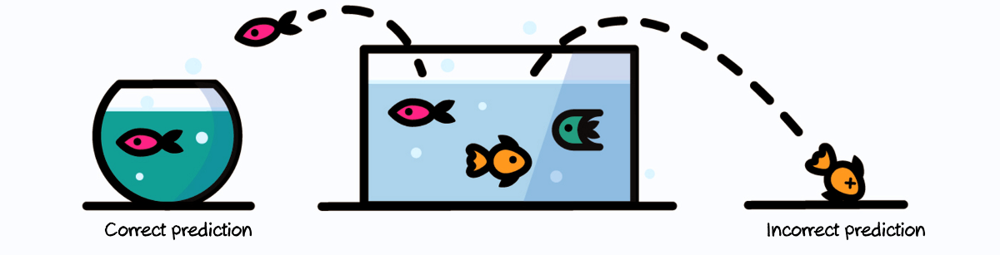

Customer Churn Prediction
==============================

Trainee Assessment: Fuse Machines


<p align="center">

</p>


Project Organization
------------
```
├── api
│   ├── app.py
│   ├── config
│   │   └── config.py
│   ├── resources
│   ├── static
│   └── templates
│  
├── checkpoints
│  
├── data
│   ├── processed
│   └── raw
│  
├── docs
│   ├── Analysis.md
│   └── Requirements.md
│  
├── notebooks
│ 
├── Customer Churn Prediction
│   ├── config
│   │   └── config.py
│   ├── data
│   │   └── make_dataset.py
│   ├── dispatcher
│   ├── features
│   │   ├── build_features.py
│   ├── models
│   │   ├── test_model.py
│   │   └── train_model.py
│   ├── utils
│   ├── visualisation
│   |   └── visualisation.py
│   └── main.py
│ 
├── Dockerfile
│ 
├── run.sh
├── logs
├── references
├── requirements.txt
├── README.md
├── LICENSE
└── tests
    └── test_environment.py
```
--------


## Getting Started

### Requirements

```
pip install -r requirements.txt
```

### Download the dataset

The following command will download the dataset from the URL given in `src/config/config.py` file .

```
python -m churnprediction.data.make_dataset
```

### Run

```
python -m churnprediction.main
```
OR

```
./run.sh
```

### Testing on Holdout Dataset

**Make the necessary changes on `tests/config`**

- Place the holdout dataset on `./data/raw`
- Rename the testing dataset to `test.csv`
- Run

```
python -m tests.test_environment
```

_Check the testing logs in `checkpoints/app.log`_

### To-do List

- [ ] Download dataset
- [ ] Pre-process data
- [ ] Train model
- [ ] Test model
- [ ] Main Pipeline

-------------------------------
